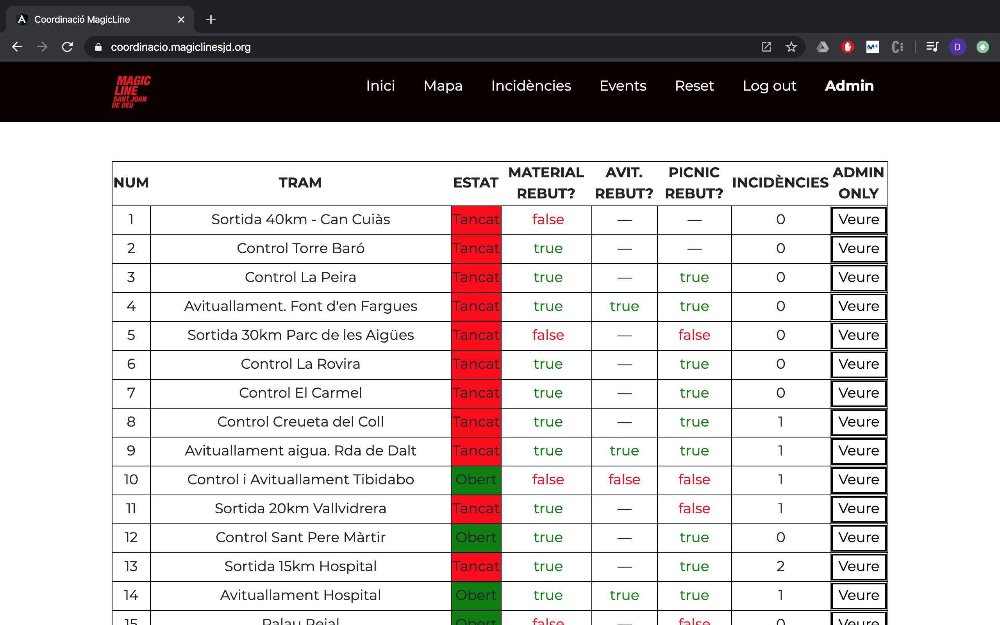
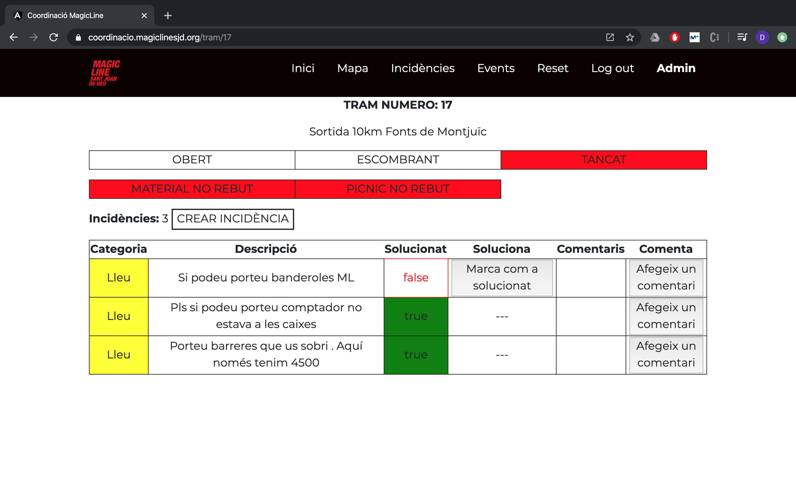

# MLapp

Welcome!

This a non-profit project realised in collaboration between <b>Universitat Politècnica de Catalunya</b> (UPC) and the NGO <b>Sant Joan de Déu</b> (SJD). You can learn more about SJD soladarity projects at http://solidaritat.santjoandedeu.org/es

<b>Carla Campàs</b> and <b>Daniel Morales</b> are two students at UPC who have enrolled on a volunteering program and have been working with SJD for 4 months by developing this application for them.

## The Application

The aim of this application is to coordinate and reduce complexity in the organization of the Magic Line (http://magiclinesjd.org/es), an event held in Barcelona on March 1st 2020 that raised more than 300.000€ for solidarity projects. The event consists on a family hike through the streets of Barcelona with numerous cultural activities along the way. In total, more than 60km of route divided in 27 sections, everything made possible by hundreds of volunteers. 

The complexity of coordinating such a number of people was very high. MLapp is a prototype for an application that helps reduce that complexity by providing the responsibles of each section with a platform to comunicate with the hike director. Users can indicate the state of the tram (Open/Sweeping/Closed), notify when they have received the expected material, picnic, etc... and open incident tickets for any unexpected problem. All the information is gathered in one place, thus providing a real time picture of the whole hike to the director, as well as recording all action and issues, which can be used for review and improvement on next editions.

The application is accessible both on mobile devices and on computers, having the same functionalities in both platforms. These are some examples of the looks of the app on desktop:

## Development

A Progressive Web Application (PWA) was developed with Angular + Node.js + MongoDB, and it was run on an AWS free tier EC2 Ubuntu server, making the project completely cost free.

The frontend of the application, made with Angular, can be found in this repository, while the backend is available in https://github.com/Morales97/rest-apiML

The resulting PWA can be found (as of March 2020) in https://coordinacio.magiclinesjd.org but the full functionality will not be accessible unless provided with a username and password. On mobile devices, once you go into the website you have the option to install it so it behaves like a usual application.

The deployment on AWS was done with the following guidelines: https://jasonwatmore.com/post/2019/12/02/angular-nodejs-on-aws-how-to-deploy-a-mean-stack-app-to-amazon-ec2

## Contact

Carla Campàs: ccg.campas@gmail.com  
Daniel Morales: danimoralesbrotons@gmail.com  
UPC: voluntariat.ccd@upc.edu  
SJD: coordinacio@magiclinesjd.org  

