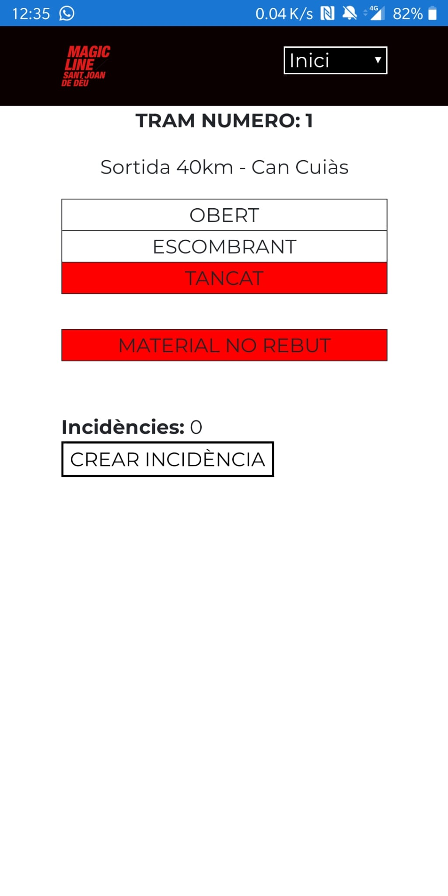

# MLapp

Welcome!

This a non-profit project realised in collaboration between <b>Universitat Politècnica de Catalunya</b> (UPC) and the NGO <b>Sant Joan de Déu</b> (SJD). You can learn more about SJD soladarity projects at http://solidaritat.santjoandedeu.org/es

<b>Carla Campàs</b> and <b>Daniel Morales</b> are two students at UPC who enrolled on a volunteering program and have been working with SJD for 4 months developing an application for the NGO.

## The Application

The aim of this application is to coordinate and reduce complexity in the organization of the Magic Line (http://magiclinesjd.org/es), an event held in Barcelona on March 1st 2020 that raised more than 300.000€ for solidarity projects. The event consists on a family hike through the streets of Barcelona with numerous cultural activities along the way. In total, more than 60km of route divided in 27 sections, everything made possible by hundreds of volunteers. 

The complexity of coordinating such a number of people was very high. MLapp is a prototype for an application that helps reduce that complexity by providing the responsibles of each section with a platform to comunicate with the hike director. Users can indicate the state of the tram (Open/Sweeping/Closed), notify when they have received the expected material, picnic, etc... and open incident tickets for any unexpected problem. All the information is gathered in one place, thus providing a real time picture of the whole hiking sections to the director, as well as recording all movement and issues that can be used for review and improvement on next editions.

The application is accessible both on mobile devices and on computers, having the same functionalities in both platforms. These are some examples of the looks of the app on desktop:

## Development

A Progressive Web Application (PWA) was developed with Angular + Node.js + MongoDB, and it was run on an AWS free tier EC2 Ubuntu server, making the project completely cost free.

The frontend of the application, made with Angular, can be found in this repository, while the backend is available in https://github.com/Morales97/rest-apiML

The resulting PWA can be found (as of March 2020) in 

## Contact

Carla Campàs: ccg.campas@gmail.com
Daniel Morales: danimoralesbrotons@gmail.com
UPC: voluntariat.ccd@upc.edu
SJD: coordinacio@magiclinesjd.org

# About Angular

This project was generated with [Angular CLI](https://github.com/angular/angular-cli) version 8.3.20.

## Development server

Run `ng serve` for a dev server. Navigate to `http://localhost:4200/`. The app will automatically reload if you change any of the source files.

## Code scaffolding

Run `ng generate component component-name` to generate a new component. You can also use `ng generate directive|pipe|service|class|guard|interface|enum|module`.

## Build

Run `ng build` to build the project. The build artifacts will be stored in the `dist/` directory. Use the `--prod` flag for a production build.

## Running unit tests

Run `ng test` to execute the unit tests via [Karma](https://karma-runner.github.io).

## Running end-to-end tests

Run `ng e2e` to execute the end-to-end tests via [Protractor](http://www.protractortest.org/).

## Further help

To get more help on the Angular CLI use `ng help` or go check out the [Angular CLI README](https://github.com/angular/angular-cli/blob/master/README.md).

# Com utilitzar git

## clonar repositori:

`git clone https://github.com/Morales97/MLapp`

## per fer canvis

1. Actualitzar master amb última versió: desde branca master `git pull`
2. Crear una nova branca: `git branch <la teva branca>`
3. Moure's a la nova branca: `git checkout <la teva branca>` 
Per comprovar en qualsevol moment en quina branca estas, `git branch`
4. ** fer canvis **
5. Commitejar (aka guardar) els canvis: 
  `git add *` 
  `git commit -m <missatge>`
** repetir 4. i 5. tants cops com calgui mentre es va treballant **
6. Un cop es vol penjar els canvis, moure's a master: `git checkout master`
7. Actualitzar master amb última versió: `git pull`
8. Merge la teva branca al master: desde master `git merge <la teva branca>`
9. Penjar els canvis al repositori remot: `git push origin master`

# Com passar els audits

Per comprovar que la PWA funciona bé, Developer tools del chrome -> Audits 
Per passar tots els audits, cal que una versio de 'production' corri en un servidor: 
`npm install -g http-server` 
`ng build --prod` 
`cd dist/MLapp` 
`http-server` 
En canvi, per fer testing normal simplement amb `ng serve` a la carpeta del projecte val

 

